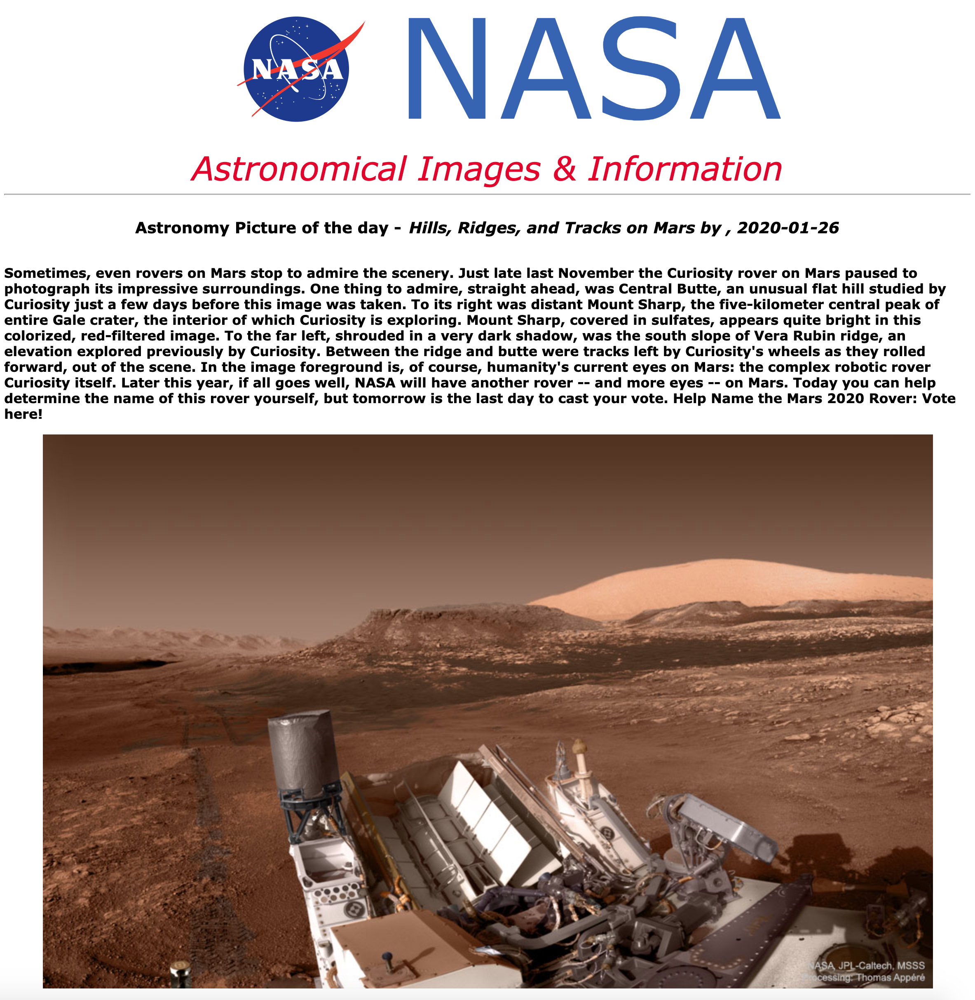

# NASA-Viewer



This is a React web app project that employs the use of one of NASA's public API's -the Astronomy Picture of 
the day. There is more to come and in time will have a website to view every single one seperately with all of their packaged up fun miscellaneous information for all of your astronomical curiositys.

## Please feel free to demo the project by taking these steps..
```
Clone or fork the repo
```
```
npm install
```
```
npm start
```
```
Open your browser to view on localhost: 3000
```
* **Thank you**, ***-Miles Mickelson***
